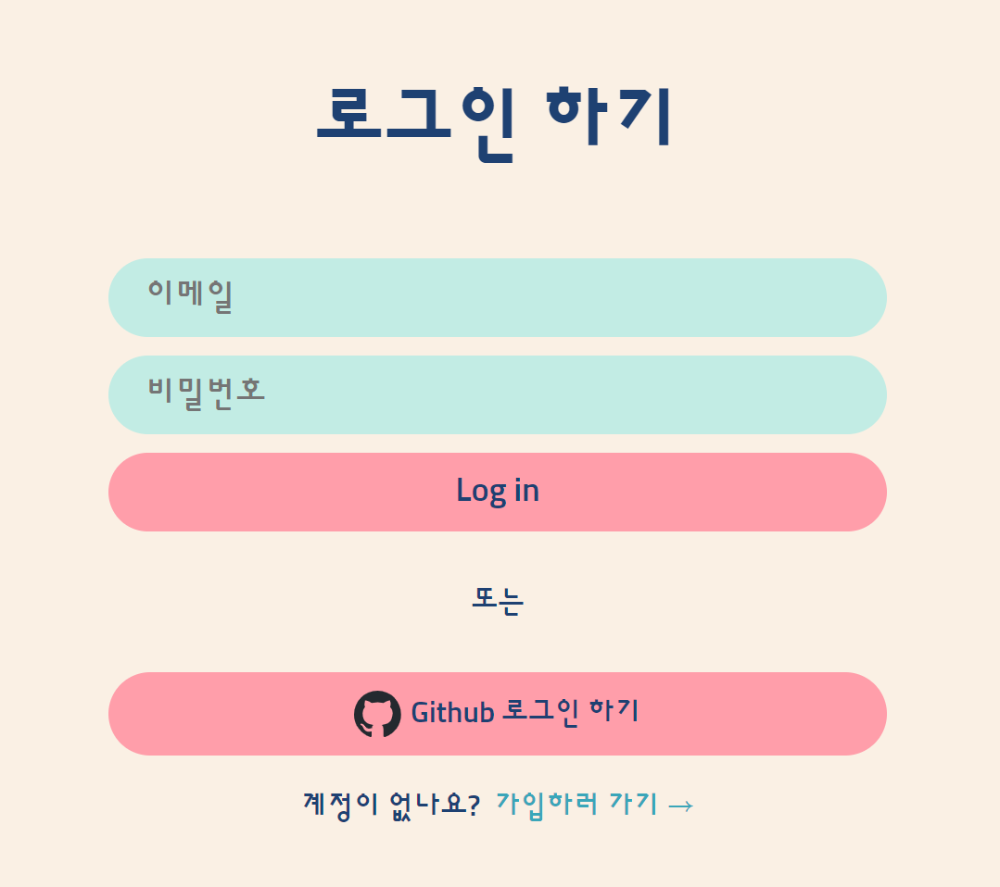
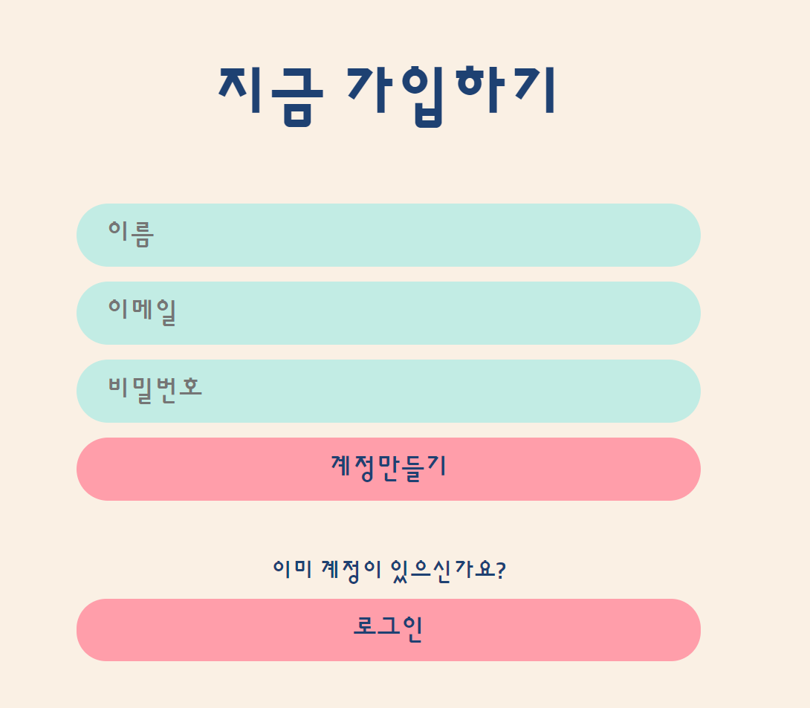
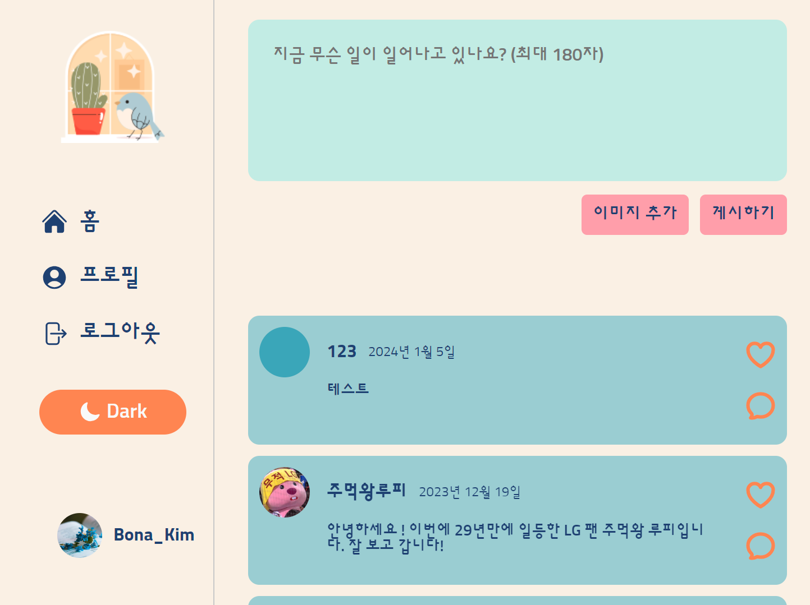
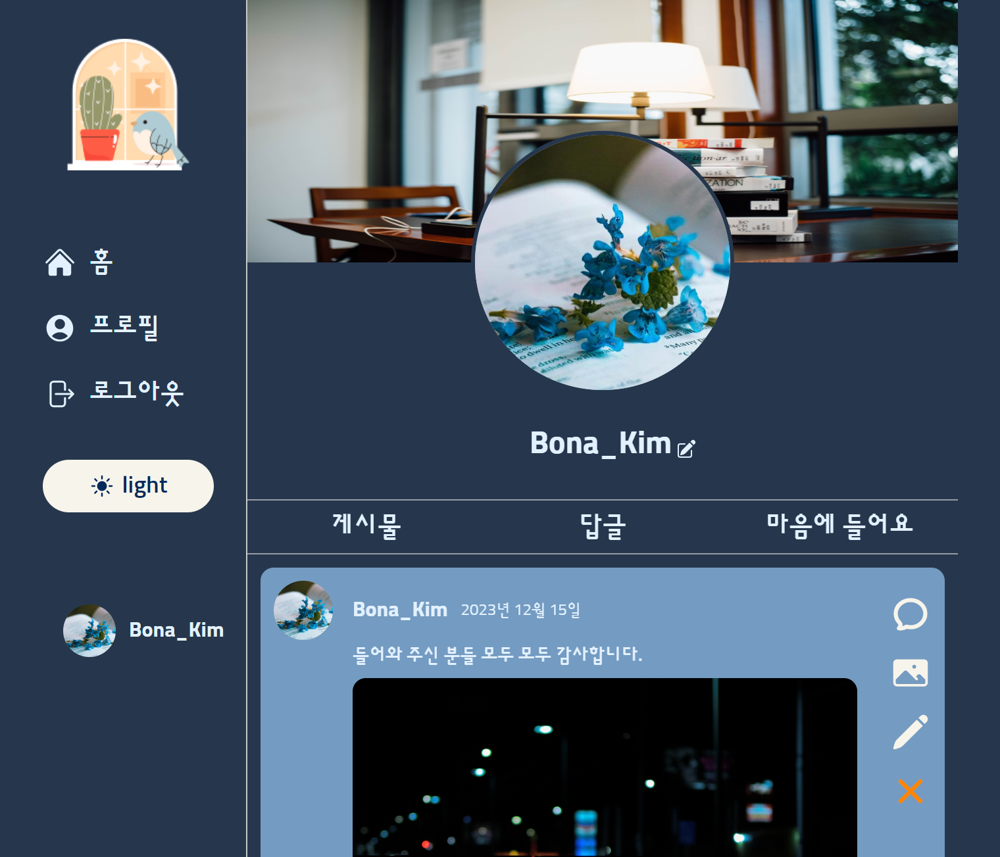

# Bwitter

### 기간

-   2023.12.01 ~ 2023.12.16

### Link

-   [github repository](https://github.com/Bona023/bwitter)
-   [배포 url](https://bwitter-reloaded.firebaseapp.com/)

### 프로젝트 소개

-   트위터 클론 코딩 어플입니다.
-   노마드코더 트위터 클론 코딩 콘테스트에 참가하기 위해 제작했고 콘테스트 기간이 2주였습니다.
-   마감시간 때문에 프로필 페이지를 100% 구현하지 못해서 아쉬웠던 프로젝트였습니다.
-   목표로 했던 기능들을 70% 정도만 구현했다고 생각합니다. 앞으로 공부하면서 수정하고 추가할 생각입니다.

### 구현기능

-   이메일 가입, Github 로그인
-   라이트모드/다크모드 버튼
-   실시간 글쓰기, 수정하기, 댓글쓰기
-   프로필 페이지, 프로필 수정

### 사용스택

-   React, TypeScript, Firebase, Vite

### 구현모습

-   로그인 페이지
    

-   가입 페이지
    

-   홈
    

-   프로필 페이지
    
