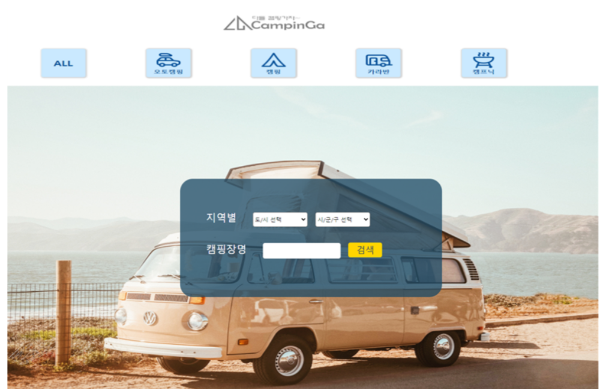

# Campinga

### 기간

-   2023.02.08 ~ 2023.02.24

### Link

-   [github repository](https://github.com/Bona023/CampinGa)
-   배포 (X)

### 프로젝트 소개

-   국비 교육과정에서 5명의 팀프로젝트로 진행한 웹 애플리케이션입니다.
-   Spring boot를 기반으로 구현했고 데이터베이스는 OracleDB를 사용했습니다.
-   캠핑장을 검색하고 예약하는 웹사이트를 목표로 만들었고,
    캠핑장, 사용자, 관리자가 각각 사용할 수 있는 기능이 분리 된 사이트 입니다.

### 맡은 역할

-   html, CSS, Jquery, JSP를 사용해서 페이지를 구성하고 효과 넣기
-   이름, 지역으로 캠핑장 검색하기
-   메인 페이지의 배너 구현하기 (DB에 저장된 이미지 가져와서 배너에 넣고 효과까지)
-   배너를 수정하는 페이지 만들기
-   배너 수정 기능(DB와 연결하기)
-   id, pw 찾기/수정 하는 페이지 만들기
-   id/pw 찾고 수정하는 기능

### 구현기능

-   일반 사용자 : 캠핑장 검색, 캠핑장 정보보기, QnA/후기 등록하기, 즐겨찾기 추가/삭제, 캠핑장 예약하기, 마이페이지에서 예약 확인하기
-   캠핑장 : 캠핑장 등록, 캠핑장 정보 등록하기, 마이페이지에서 들어온 예약 확인하기
-   관리자 : 전체 예약 보기, 배너 이미지 수정/삭제, 캠핑장 가입자 수락/거부

### 사용스택

-   Spring boot, OracleDB, JQuery, Javascript, JSP

### 구현모습

-   메인 페이지의 배너와 검색창
    
