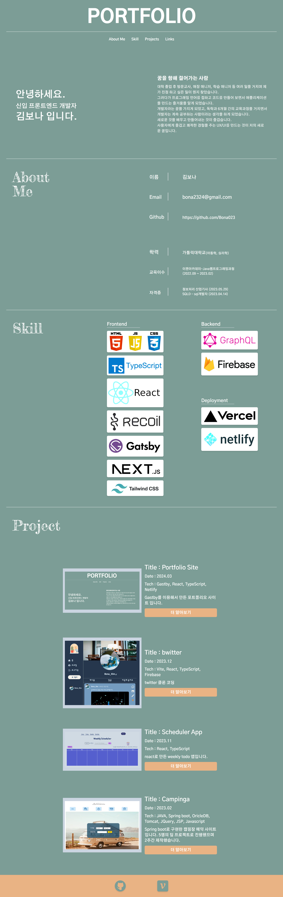
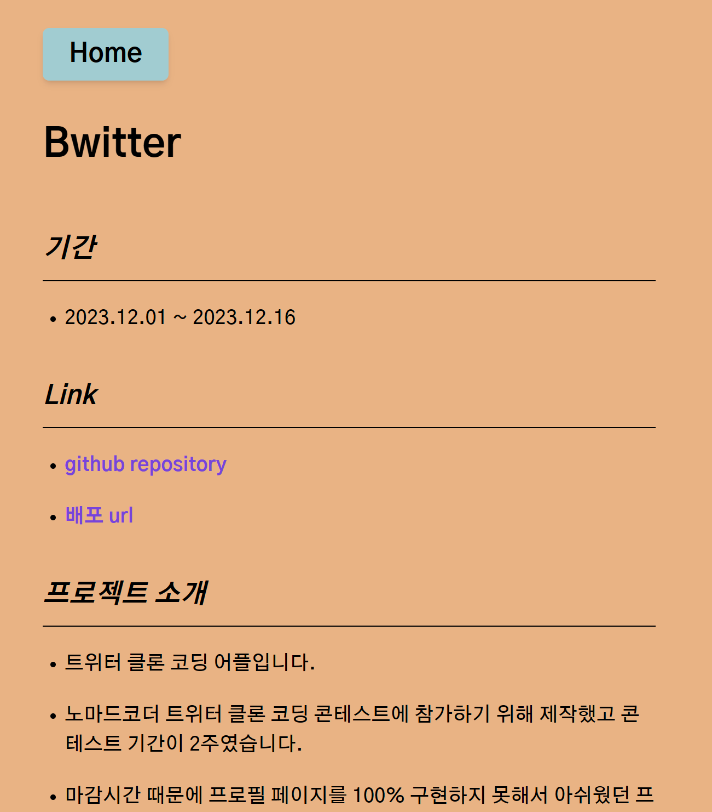
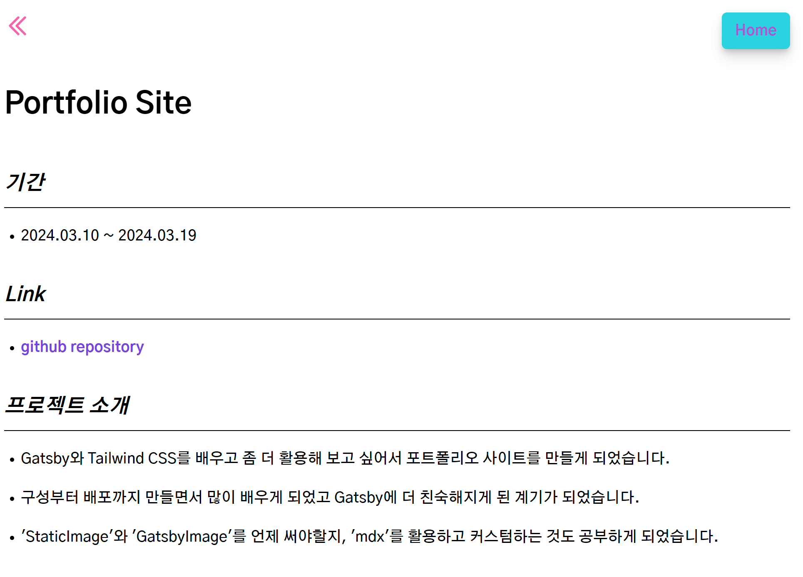

# Portfolio Site

### 기간

-   2024.03.10 ~ 2024.03.19

### Link

-   [github repository](https://github.com/Bona023/bona-portfolio)

### 프로젝트 소개

-   Gatsby와 Tailwind CSS를 배우고 좀 더 활용해 보고 싶어서 포트폴리오 사이트를 만들게 되었습니다.
-   구성부터 배포까지 만들면서 많이 배우게 되었고 Gatsby에 더 친숙해지게 된 계기가 되었습니다.
-   'StaticImage'와 'GatsbyImage'를 언제 써야할지, 'mdx'를 활용하고 커스텀하는 것도 공부하게 되었습니다.

### 구현기능

-   간단한 자기소개와 프로젝트 설명, github과 블로그 링크

### 사용스택

-   Gatsby, TypeScript, Tailwind CSS, Netlify

### 구현모습

-   2024.05.26 ~ 2024.06.09 : version02 배포
-   좀 더 인터렉티브하고 간결해 보이고 싶어 사이트를 전반적으로 수정해서 배포했습니다. (메인 이미지는 v1 캡쳐화면 입니다.)
-   기존에 한 페이지에 모든 정보를 넣었다면 v2에서는 자기소개, skill, project를 각각 따로 나누어서 한 눈에 전체페이지가 보일 수 있도록 수정했습니다.
-   그에 따라 프로젝트 상세페이지에는 홈 버튼과 project 페이지로 가는 버튼을 따로 넣어서 버튼이 추가 되었습니다.
-   기존의 모습을 비교하고 기록으로 남기기 위해서 v1과 v2 캡쳐화면을 둘 다 아래에 넣어보았습니다

 

-   version01 메인페이지
    

-   프로젝트 상세 페이지
    
    
