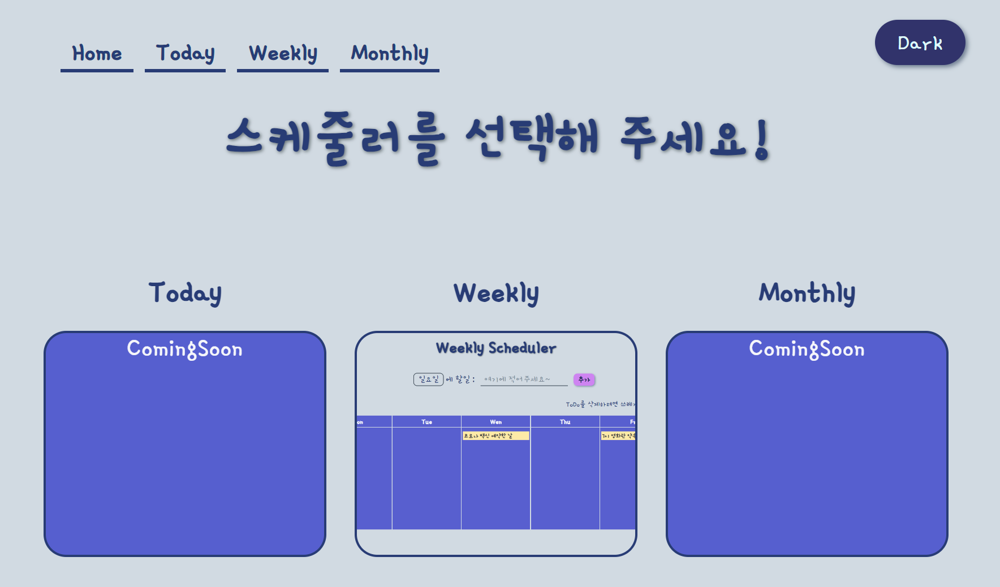
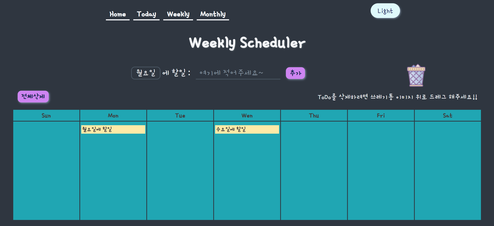

# Scheduler App

### 기간

-   2023.11.03 ~

### Link

-   [github repository](https://github.com/Bona023/Scheduler)
-   [배포 url](https://bona023.github.io/Scheduler/)

### 프로젝트 소개

-   React와 TypeScript를 기반으로 구현했고 github page로 배포했습니다.
-   React와 TypeScript를 배우고 이를 활용한 작은 프로젝트를 만들고 싶어서 시작했습니다.
-   일, 주, 월 단위의 스케줄을 관리할 수 있는 앱이 목표였으나 현재 주 단위만 구현한 상태입니다.

### 구현기능

-   weekly를 보드형으로 구현했습니다. ToDo를 드래그앤드롭으로 옮기거나 삭제할 수 있습니다.
-   다크모드/라이트모드 버튼

### 사용스택

-   React, TypeScript, Github Pages

### 구현모습

-   홈 (today, weekly, monthly 선택 화면)
    
-   다크모드
    
